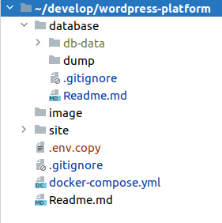

# WORDPRESS DOCKER - INCLUDE HOT RELOAD
 
## Requirements
1. [Docker](https://docs.docker.com/install/)
2. [Docker Compose](https://docs.docker.com/compose/install/)

## Structure Directory   


## Add custom values  
```bash
$ cp .env.copy .env
 ```
- DB_USER=
- DB_NAME=
- DB_PASS=
- DB_ROOT_PASS=

## How to run it?
1. Clone the repository:
```bash
$ git clone https://github.com/ypasoft/wordpress-docker-compose.git
```

2. We are using shared fol ders to enable live code reloading. Without this, Docker Compose will not start:
    - Windows/MacOS: Add the cloned `saleor-platform` directory to Docker shared directories (Preferences -> Resources -> File sharing).
    - Windows/MacOS: Make sure that in Docker preferences you have dedicated at least 5 GB of memory (Preferences -> Resources -> Advanced).
    - Linux: No action required, sharing already enabled and memory for Docker engine is not limited.

3. Go to the cloned directory:
```bash
$ cd wordpress-platform
```

4. Run the application:
```bash
$ docker-compose up
```

## How to solve issues with lack of available space

Remove existing volumes

**Warning!** Proceeding will remove also your database container! If you need existing data, please remove only services which cause problems! https://docs.docker.com/compose/reference/rm/
```bash
docker-compose rm
```

Run fresh containers
```bash
docker-compose run -d
```

Now you can run fresh environment using commands from `How to run it?` section. Done!

### Still no available space

If you are getting issues with lack of available space, consider prunning your docker cache:

**Warning!** This will remove:
- all stopped containers
- all networks not used by at least one container
- all dangling images
- all dangling build cache

More info: https://docs.docker.com/engine/reference/commandline/system_prune/

<details><summary>I've been warned</summary>
<p>

```bash
$ docker system prune
```

</p>
</details>

## Where is the application running?
- Wordpress - http://localhost:8080
- Database - localhost:3306

